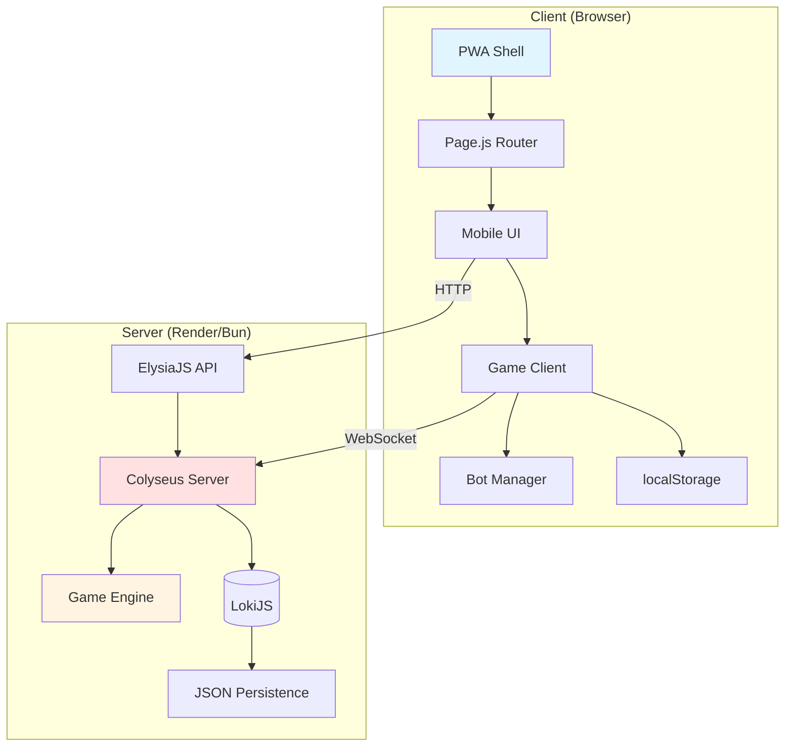
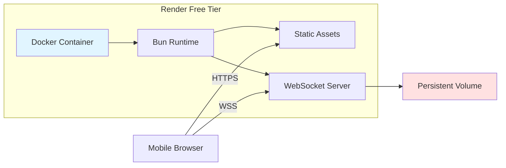
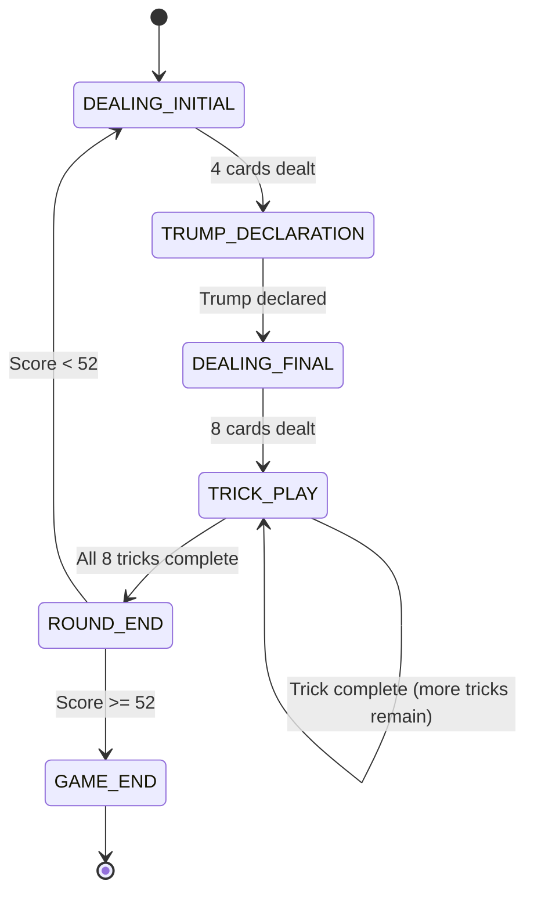

# Design Document: Contract Crown Game

## Overview

Contract Crown is a mobile-first Progressive Web App implementing a real-time 4-player trick-taking card game with both offline bot practice and online multiplayer modes. The system uses a client-server architecture with authoritative state management for online play and a fully client-side implementation for offline practice.

### Core Design Principles

1. **Mobile-First**: All UI and interaction patterns optimized for portrait-mode mobile devices with thumb-zone accessibility
2. **Progressive Enhancement**: Offline-first architecture with online multiplayer as an enhancement
3. **Performance**: 60 FPS animations, <100ms response times, <2s initial load on 3G
4. **Authoritative Server**: Colyseus manages game state for online play to prevent cheating
5. **Zero-Budget Infrastructure**: Designed for Render free tier with ephemeral filesystem considerations

### Technology Stack Rationale

- **Bun**: Ultra-fast TypeScript runtime with native support, reducing build complexity
- **Colyseus**: Battle-tested real-time game server with built-in state synchronization
- **ElysiaJS**: High-performance Bun-native web framework with minimal overhead
- **LokiJS**: In-memory database with JSON persistence, ideal for ephemeral filesystems
- **Page.js**: Lightweight client-side routing without framework overhead
- **Tailwind + DaisyUI**: Utility-first CSS with pre-built mobile-optimized components
- **Service Workers**: Standard PWA caching for offline capability

## Architecture

### High-Level System Architecture



### Deployment Architecture



### Game Mode Architecture

The system supports two distinct game modes with shared core logic:

**Offline Mode (Bot Practice)**:
- Game Engine runs entirely in browser
- Bot Manager provides 3 AI opponents
- No network communication required
- State persisted to localStorage only

**Online Mode (Multiplayer)**:
- Colyseus server maintains authoritative state
- Clients send actions, receive state updates
- Reconnection handling with 60s timeout
- Bot replacement for disconnected players

## Components and Interfaces

### 1. Game Engine (Core Logic)

The Game Engine is the heart of the system, implementing all card game rules. It must be deterministic and stateless to work identically on client and server.

**Responsibilities**:
- Deck creation and shuffling
- Card dealing (two-phase: 4 cards, then 4 more)
- Trump declaration validation
- Trick-taking rule enforcement (suit following, trump precedence)
- Trick winner determination
- Crown rule implementation (retention/rotation)
- Winner-takes-all scoring
- Game completion detection (52 points)

**Key Interfaces**:

```typescript
interface GameState {
  deck: Card[];
  players: Player[];
  currentTrick: Trick;
  completedTricks: Trick[];
  trumpSuit: Suit | null;
  crownHolder: number; // player index
  dealer: number; // player index
  phase: 'DEALING_INITIAL' | 'TRUMP_DECLARATION' | 'DEALING_FINAL' | 'TRICK_PLAY' | 'ROUND_END' | 'GAME_END';
  scores: [number, number]; // [team0, team1]
  currentPlayer: number;
}

interface Card {
  suit: Suit;
  rank: Rank;
}

type Suit = 'HEARTS' | 'DIAMONDS' | 'CLUBS' | 'SPADES';
type Rank = '7' | '8' | '9' | '10' | 'J' | 'Q' | 'K' | 'A';

interface Player {
  id: number;
  hand: Card[];
  team: 0 | 1; // Team 0: players 0&2, Team 1: players 1&3
  isBot: boolean;
}

interface Trick {
  leadPlayer: number;
  cards: PlayedCard[];
  winner: number | null;
}

interface PlayedCard {
  card: Card;
  player: number;
}

class GameEngine {
  createDeck(): Card[];
  shuffle(deck: Card[]): Card[];
  dealInitial(state: GameState): void;
  dealFinal(state: GameState): void;
  validateDeal(state: GameState): boolean;
  checkForExtremeHand(state: GameState): boolean;
  declareTrump(state: GameState, suit: Suit): void;
  canPlayCard(state: GameState, player: number, card: Card): boolean;
  playCard(state: GameState, player: number, card: Card): void;
  resolveTrick(trick: Trick, trumpSuit: Suit): number;
  calculateScore(state: GameState): void;
  updateCrown(state: GameState): void;
  rotateDeal(state: GameState): void;
  isGameComplete(state: GameState): boolean;
}
```

**Design Decisions**:
- Immutable state updates for predictable behavior
- Separate validation (`canPlayCard`) from mutation (`playCard`)
- Cryptographically secure shuffling using Web Crypto API
- Fixed partnerships: Team 0 (players 0 & 2), Team 1 (players 1 & 3)
- Re-deal validation occurs after final dealing phase to ensure fair hand distribution
- Re-deal check loops until a valid deal is achieved (no player has 3+ Aces or 3+ Sevens)

### 2. Bot Manager (AI Opponents)

Provides AI logic for offline practice and replacement of disconnected players.

**Responsibilities**:
- Select legal cards to play within 1 second
- Implement basic strategy (trump usage, suit following)
- Simulate human-like timing delays
- Support trump declaration decisions

**Strategy Implementation**:
- **Trump Declaration**: Choose suit with most cards in initial hand
- **Leading**: Play highest non-trump card, or lowest trump if only trumps remain
- **Following**: Play lowest card that follows suit, or lowest trump if cannot follow, or lowest card if no trumps
- **Timing**: Random delay 500-1500ms to simulate human decision-making

**Key Interface**:

```typescript
class BotManager {
  selectTrumpSuit(hand: Card[]): Suit;
  selectCard(state: GameState, playerIndex: number): Card;
  private evaluateHand(hand: Card[], trumpSuit: Suit | null): number;
  private shouldPlayTrump(state: GameState, hand: Card[]): boolean;
}
```

### 3. Mobile UI (Presentation Layer)

Implements the "Felt Grid" layout with thumb-zone optimization.

**Layout Structure** (3x3 Grid - no separate header):
```
┌─────────────┬──────────┬─────────────┐
│ Trump       │ Partner  │ Crown +     │ 15%
│ Indicator   │ (Top)    │ Scores      │
├─────────────┼──────────┼─────────────┤
│             │          │             │
│ Opp Left    │  Trick   │  Opp Right  │ 55%
│             │  Area    │             │
├─────────────┼──────────┼─────────────┤
│ Trick Count │ User Hand│ Return Btn  │ 30%
│             │ (Bottom) │             │
│             │ [Thumb]  │             │
└─────────────┴──────────┴─────────────┘
```

**Component Hierarchy**:
- `GameView`: Root container
  - `FeltGrid`: Full-screen 3x3 grid play area (includes header data in corner cells)
    - `topLeft`: Trump suit indicator
    - `partnerDisplay` (top-center): Partner avatar and card count
    - `topRight`: Crown holder name + team scores
    - `leftOpponentDisplay`: Left opponent
    - `trickArea` (center): Active trick cards + pending trick display buffer
    - `rightOpponentDisplay`: Right opponent
    - `bottomLeft`: Trick count indicator
    - `userHand` (bottom-center): User's interactive hand
    - `bottomRight`: Return to lobby button
  - `TrumpSelector`: Modal for declaration
  - `RoundEndModal`: Round results
  - `VictoryModal`: Game completion

**Key Features**:
- CSS Grid for responsive felt layout
- Touch event handling for card selection
- Playability state visualization (dimming)
- Pulsing ring animation for active player
- Card flight animations using CSS transforms

**Interface**:

```typescript
interface UIState {
  gameState: GameState;
  selectedCard: Card | null;
  playableCards: Card[];
  animatingCards: AnimatingCard[];
  showTrumpSelector: boolean;
  showRoundEnd: boolean;
  showVictory: boolean;
}

interface AnimatingCard {
  card: Card;
  from: Position;
  to: Position;
  duration: number;
  startTime: number;
}

class MobileUI {
  render(state: UIState): void;
  handleCardTap(card: Card): void;
  handleTrumpSelection(suit: Suit): void;
  animateCardPlay(card: Card, from: Position, to: Position): void;
  updatePlayability(state: GameState, playerIndex: number): void;
}
```

### 4. PWA Shell (Application Container)

Manages routing, service workers, and offline capability.

**Responsibilities**:
- Client-side routing (/login, /lobby, /game)
- Service worker registration and caching
- Manifest.json for standalone mode
- Authentication state management
- Network status detection

**Caching Strategy**:
- **App Shell**: Cache all HTML, CSS, JS (cache-first)
- **Card Assets**: Cache all SVG card images (cache-first)
- **API Calls**: Network-first with fallback
- **Game State**: Never cache (always fresh)

**Interface**:

```typescript
class PWAShell {
  initRouter(): void;
  registerServiceWorker(): void;
  checkAuth(): boolean;
  navigate(path: string): void;
  handleOffline(): void;
  handleOnline(): void;
}

// Page.js routes
page('/login', renderLogin);
page('/lobby', requireAuth, renderLobby);
page('/game/:roomId', requireAuth, renderGame);
```

### 5. Session Manager (Authentication)

Handles user authentication and session persistence.

**Responsibilities**:
- Token-based authentication
- localStorage session persistence
- 30-day session expiration
- Auto-login on app load
- Logout functionality

**Security Considerations**:
- Tokens stored in localStorage (acceptable for free-tier game)
- Server validates all tokens on WebSocket connection
- No sensitive data stored client-side
- HTTPS enforced for all communication

**Interface**:

```typescript
interface SessionData {
  userId: string;
  username: string;
  token: string;
  expiresAt: number;
}

class SessionManager {
  login(username: string, password: string): Promise<SessionData>;
  logout(): void;
  getSession(): SessionData | null;
  isAuthenticated(): boolean;
  refreshToken(): Promise<void>;
}
```

### 6. Colyseus Server (Online Multiplayer)

Authoritative game server managing real-time multiplayer rooms.

**Responsibilities**:
- Room creation and matchmaking
- State synchronization to all clients
- Action validation (prevent cheating)
- Reconnection handling (60s timeout)
- Bot replacement for disconnected players
- Game state persistence

**Room Lifecycle**:
1. **Creation**: Player creates room, becomes host
2. **Joining**: 3 more players join (or bots fill)
3. **Playing**: Server processes actions, broadcasts state
4. **Completion**: Results saved, room closes after 30s
5. **Cleanup**: Room disposed, data persisted

**Key Interface**:

```typescript
class CrownRoom extends Room<GameState> {
  onCreate(options: any): void;
  onJoin(client: Client, options: any): void;
  onLeave(client: Client, consented: boolean): void;
  onDispose(): void;
  
  @Command()
  declareTrump(client: Client, suit: Suit): void;
  
  @Command()
  playCard(client: Client, card: Card): void;
  
  private validateAction(client: Client, action: any): boolean;
  private broadcastState(): void;
  private handleReconnection(client: Client): void;
  private replaceWithBot(playerIndex: number): void;
}
```

### 7. Haptic Controller (Feedback System)

Manages device vibration for tactile feedback.

**Vibration Patterns**:
- **Your Turn**: Single short pulse (50ms)
- **Trick Won**: Double pulse (50ms, 50ms with 100ms gap)
- **Trump Declared**: Triple pulse (30ms, 30ms, 30ms with 50ms gaps)
- **Victory**: Long celebration pattern (100ms, 50ms, 100ms, 50ms, 200ms)

**Interface**:

```typescript
class HapticController {
  private isSupported: boolean;
  
  triggerYourTurn(): void;
  triggerTrickWon(): void;
  triggerTrumpDeclared(): void;
  triggerVictory(): void;
  
  private vibrate(pattern: number | number[]): void;
}
```

### 8. LokiJS Persistence Layer

In-memory database with JSON file persistence for user data.

**Collections**:
- **users**: User profiles and authentication
- **games**: Completed game records
- **statistics**: Per-user statistics

**Persistence Strategy**:
- Auto-save every 5 minutes
- Save on server shutdown
- Load on server startup
- Backup to external volume on Render

**Schema**:

```typescript
interface UserDocument {
  userId: string;
  username: string;
  passwordHash: string;
  createdAt: number;
  lastLogin: number;
}

interface GameDocument {
  gameId: string;
  players: string[]; // userIds
  winner: 0 | 1; // team
  finalScores: [number, number];
  rounds: number;
  completedAt: number;
}

interface StatisticsDocument {
  userId: string;
  gamesPlayed: number;
  gamesWon: number;
  totalPoints: number;
  averagePointsPerGame: number;
}
```

## Data Models

### Card Representation

Cards are represented as simple objects with suit and rank. Rank ordering for trick resolution:

**Rank Values** (ascending):
- 7: 0
- 8: 1
- 9: 2
- 10: 3
- J: 4
- Q: 5
- K: 6
- A: 7

**Trick Resolution Logic**:
1. If any trump cards played: highest trump wins
2. If no trump cards: highest card of led suit wins
3. Ties impossible (only one card of each suit/rank combination)

### Game State Machine



### Team and Player Mapping

Fixed partnerships:
- **Team 0**: Players 0 and 2
- **Team 1**: Players 1 and 3

Player positions in UI:
- **Position 0** (User): Bottom
- **Position 1** (Opponent): Left
- **Position 2** (Partner): Top
- **Position 3** (Opponent): Right

### Network Protocol (Colyseus Messages)

**Client → Server**:
```typescript
{
  type: 'DECLARE_TRUMP',
  suit: Suit
}

{
  type: 'PLAY_CARD',
  card: Card
}

{
  type: 'READY'
}
```

**Server → Client**:
```typescript
{
  type: 'STATE_UPDATE',
  state: GameState
}

{
  type: 'ERROR',
  message: string
}

{
  type: 'PLAYER_DISCONNECTED',
  playerIndex: number
}

{
  type: 'PLAYER_RECONNECTED',
  playerIndex: number
}
```


## Correctness Properties

*A property is a characteristic or behavior that should hold true across all valid executions of a system—essentially, a formal statement about what the system should do. Properties serve as the bridge between human-readable specifications and machine-verifiable correctness guarantees.*

### Property Reflection

After analyzing all acceptance criteria, I identified the following redundancies:
- **1.5 is redundant with 1.4**: Both verify 8 cards after final dealing
- **3.7 is redundant with 3.6**: Both describe trick resolution logic
- **8.4 is redundant with 3.3**: Both verify all cards playable when leading
- **10.3 is redundant with 10.2**: Legal card selection implies rule following
- **16.3 is redundant with 9.4**: Both trigger victory vibration

These redundant properties have been consolidated into single comprehensive properties below.

### Property 1: Deck Composition

*For any* newly created deck, it SHALL contain exactly 32 cards with exactly 8 cards of each suit (Hearts, Diamonds, Clubs, Spades) and exactly 4 cards of each rank (7, 8, 9, 10, J, Q, K, A).

**Validates: Requirements 1.1**

### Property 2: Shuffle Preservation

*For any* deck, shuffling SHALL preserve all cards (no cards added, removed, or duplicated) while producing a different ordering.

**Validates: Requirements 1.2**

### Property 3: Initial Deal Distribution

*For any* game state after initial dealing, each of the 4 players SHALL have exactly 4 cards, and the sum of cards in all hands plus remaining deck SHALL equal 32.

**Validates: Requirements 1.3**

### Property 4: Final Deal Distribution

*For any* game state after final dealing, each of the 4 players SHALL have exactly 8 cards, and the deck SHALL be empty.

**Validates: Requirements 1.4, 1.5**

### Property 4.1: Re-Deal on Extreme Hand Condition

*For any* game state after final dealing, if any player has 3 or more Aces OR 3 or more Sevens, the game state SHALL be invalidated and a new deal SHALL be initiated with all cards re-shuffled and re-dealt to all 4 players.

**Validates: Requirements 1.6, 21.1, 21.2, 21.3, 21.4, 21.5**

### Property 5: Crown Holder Identification

*For any* game state after initial dealing, the crown holder SHALL be a valid player index (0-3).

**Validates: Requirements 2.1**

### Property 6: Trump Declaration

*For any* valid suit selection by the crown holder, the game state SHALL update to set that suit as the trump suit for the current round.

**Validates: Requirements 2.3**

### Property 7: First Trick Leader

*For any* dealer position, the lead player for the first trick SHALL be (dealer + 1) % 4.

**Validates: Requirements 3.1**

### Property 8: Turn Order Progression

*For any* trick in progress, after a player plays a card, the current player SHALL advance to (currentPlayer + 1) % 4.

**Validates: Requirements 3.2**

### Property 9: Lead Player Freedom

*For any* game state where a player is leading a trick, all cards in that player's hand SHALL be marked as playable.

**Validates: Requirements 3.3, 8.4**

### Property 10: Suit Following Requirement

*For any* game state where a player is following in a trick and possesses cards of the led suit, only cards of the led suit SHALL be marked as playable.

**Validates: Requirements 3.4**

### Property 11: No Suit Following Freedom

*For any* game state where a player is following in a trick and possesses no cards of the led suit, all cards in that player's hand SHALL be marked as playable.

**Validates: Requirements 3.5**

### Property 12: Trick Resolution Correctness

*For any* completed trick with 4 cards, the winner SHALL be the player who played the highest trump card if any trump was played, otherwise the player who played the highest card of the led suit.

**Validates: Requirements 3.6, 3.7**

### Property 13: Trick Winner Leads Next

*For any* completed trick, the lead player for the next trick SHALL be the winner of the previous trick.

**Validates: Requirements 3.8**

### Property 14: Crown Retention on Success

*For any* round where the declaring team wins 5 or more tricks, the crown holder SHALL remain the same for the next round.

**Validates: Requirements 4.1**

### Property 15: Crown Rotation on Failure

*For any* round where the declaring team wins fewer than 5 tricks, the crown holder SHALL advance to (currentCrownHolder + 1) % 4 for the next round.

**Validates: Requirements 4.2**

### Property 16: Dealer Rotation

*For any* round completion, the dealer SHALL advance to (currentDealer + 1) % 4 for the next round regardless of crown holder status.

**Validates: Requirements 4.3**

### Property 17: Declaring Team Success Scoring

*For any* round where the declaring team wins T tricks and T >= 5, the declaring team SHALL be awarded exactly T points.

**Validates: Requirements 5.1**

### Property 18: Challenging Team Success Scoring

*For any* round where the declaring team wins fewer than 5 tricks, the challenging team SHALL be awarded points equal to the number of tricks they won.

**Validates: Requirements 5.2**

### Property 19: Score Accumulation

*For any* sequence of rounds, team scores SHALL equal the sum of all points awarded to that team across all completed rounds.

**Validates: Requirements 5.3**

### Property 20: Game Completion

*For any* game state where either team's score reaches or exceeds 52 points, the game SHALL transition to GAME_END phase and declare that team the winner.

**Validates: Requirements 5.4**

### Property 21: Playability Calculation Correctness

*For any* game state where it is a player's turn, the playability state for each card SHALL match the result of applying suit-following rules (lead = all playable, follow with suit = only that suit playable, follow without suit = all playable).

**Validates: Requirements 8.1**

### Property 22: Unplayable Card Styling

*For any* card marked as unplayable, the UI SHALL apply dimming styles and disable click handlers.

**Validates: Requirements 8.2**

### Property 23: Playable Card Styling

*For any* card marked as playable, the UI SHALL apply full brightness styles and enable click handlers.

**Validates: Requirements 8.3**

### Property 24: Active Player Indication

*For any* game state, the UI SHALL display a pulsing ring animation around the avatar of the player whose turn it is.

**Validates: Requirements 9.1**

### Property 25: Bot Legal Move Selection

*For any* game state where it is a bot's turn, the bot SHALL select a card that is marked as playable according to game rules.

**Validates: Requirements 10.2, 10.3**

### Property 26: Server Action Validation

*For any* player action sent to the Colyseus server, the server SHALL validate the action against current game rules before applying state changes, rejecting invalid actions.

**Validates: Requirements 11.2**

### Property 27: Unauthenticated Redirect

*For any* navigation attempt to /lobby or /game routes when the user is not authenticated, the PWA shell SHALL redirect to /login.

**Validates: Requirements 12.4**

### Property 28: Session Token Expiration

*For any* successful authentication, the created session token SHALL have an expiration time of exactly 30 days from creation.

**Validates: Requirements 13.2**

### Property 29: Expired Token Redirect

*For any* session token that has passed its expiration time, attempts to use that token SHALL result in redirect to /login.

**Validates: Requirements 13.4**

### Property 30: Game Result Persistence

*For any* completed game, a game record SHALL be created in the database containing player IDs, winning team, final scores, round count, and completion timestamp.

**Validates: Requirements 14.2**

### Property 31: Statistics Update

*For any* completed game, each player's statistics SHALL be updated to increment games played, conditionally increment games won, and add points scored.

**Validates: Requirements 14.5**


## Error Handling

### Client-Side Error Handling

**Network Errors**:
- **Detection**: Monitor WebSocket connection state and HTTP request failures
- **User Feedback**: Display reconnection indicator overlay with retry countdown
- **Recovery**: Automatic reconnection attempts with exponential backoff (1s, 2s, 4s, 8s, max 30s)
- **Fallback**: After 60s of failed reconnection, offer "Return to Lobby" button

**Invalid State Errors**:
- **Detection**: Validate game state structure on each update from server
- **User Feedback**: Display "Game state error" modal with "Report Issue" button
- **Recovery**: Attempt to rejoin room; if fails, return to lobby
- **Logging**: Capture full state snapshot and send to error reporting endpoint

**UI Errors**:
- **Detection**: Global error boundary catching React/rendering errors
- **User Feedback**: Display friendly error message with "Reload" button
- **Recovery**: Offer to reload page or return to lobby
- **Logging**: Capture error stack trace and component tree

**Input Validation Errors**:
- **Detection**: Validate all user inputs before sending to server
- **User Feedback**: Inline validation messages (e.g., "Invalid card selection")
- **Recovery**: Prevent invalid action submission, allow user to correct
- **Logging**: Log validation failures for debugging

### Server-Side Error Handling

**Invalid Action Errors**:
- **Detection**: Validate all client actions against current game state
- **Response**: Send error message to client with reason code
- **Recovery**: Client displays error and allows retry
- **Logging**: Log invalid actions with player ID for cheat detection

**State Corruption Errors**:
- **Detection**: Validate game state invariants after each mutation
- **Response**: Log critical error, reset room to last valid state or close room
- **Recovery**: Notify all clients of room reset/closure
- **Logging**: Capture full state history for debugging

**Database Errors**:
- **Detection**: Catch all LokiJS operation failures
- **Response**: Retry operation up to 3 times with exponential backoff
- **Recovery**: If persistence fails, continue in-memory and schedule retry
- **Logging**: Log all database errors with operation details

**Connection Errors**:
- **Detection**: Monitor client connection state in Colyseus
- **Response**: Pause game, wait for reconnection (60s timeout)
- **Recovery**: Resume game on reconnection, replace with bot on timeout
- **Logging**: Log all disconnections with timing and reason

### Error Reporting

**Client Error Reporting**:
```typescript
interface ErrorReport {
  timestamp: number;
  errorType: 'network' | 'state' | 'ui' | 'validation';
  message: string;
  stack?: string;
  gameState?: Partial<GameState>;
  userAgent: string;
  url: string;
}
```

**Server Error Reporting**:
```typescript
interface ServerErrorReport {
  timestamp: number;
  errorType: 'action' | 'state' | 'database' | 'connection';
  message: string;
  stack?: string;
  roomId?: string;
  playerId?: string;
  gameState?: Partial<GameState>;
}
```

### Graceful Degradation

**Offline Mode Fallback**:
- If server is unreachable, automatically switch to offline bot practice mode
- Display banner: "Playing offline - progress will not be saved"
- Allow seamless transition back to online when connection restored

**Feature Degradation**:
- **No Haptics**: Silently skip vibration if API unavailable
- **No Animations**: Reduce to instant state changes if performance < 30 FPS
- **No Service Worker**: App still functions without offline caching

**Performance Degradation**:
- Monitor frame rate; if < 30 FPS, disable non-essential animations
- Monitor memory usage; if high, reduce cached assets
- Monitor network latency; if > 500ms, show latency warning

## Testing Strategy

### Dual Testing Approach

This project requires both unit testing and property-based testing for comprehensive coverage:

- **Unit Tests**: Verify specific examples, edge cases, error conditions, and integration points
- **Property Tests**: Verify universal properties across all inputs using randomized test data

Together, these approaches provide comprehensive coverage where unit tests catch concrete bugs and property tests verify general correctness.

### Property-Based Testing

**Library Selection**: Use **fast-check** for JavaScript/TypeScript property-based testing

**Configuration**:
- Minimum 100 iterations per property test (due to randomization)
- Each test must reference its design document property using a comment tag
- Tag format: `// Feature: contract-crown-game, Property {number}: {property_text}`

**Example Property Test**:
```typescript
import fc from 'fast-check';

// Feature: contract-crown-game, Property 1: Deck Composition
test('deck contains exactly 32 cards with correct distribution', () => {
  fc.assert(
    fc.property(fc.constant(null), () => {
      const deck = GameEngine.createDeck();
      
      // Verify total count
      expect(deck.length).toBe(32);
      
      // Verify suit distribution
      const suits = ['HEARTS', 'DIAMONDS', 'CLUBS', 'SPADES'];
      suits.forEach(suit => {
        const suitCards = deck.filter(c => c.suit === suit);
        expect(suitCards.length).toBe(8);
      });
      
      // Verify rank distribution
      const ranks = ['7', '8', '9', '10', 'J', 'Q', 'K', 'A'];
      ranks.forEach(rank => {
        const rankCards = deck.filter(c => c.rank === rank);
        expect(rankCards.length).toBe(4);
      });
    }),
    { numRuns: 100 }
  );
});
```

**Property Test Coverage**:
- All 31 correctness properties must have corresponding property tests
- Use fast-check's built-in generators for primitives
- Create custom generators for domain objects (Card, GameState, Player)
- Test invariants that should hold across all valid game states

**Custom Generators**:
```typescript
// Generator for valid cards
const cardArbitrary = fc.record({
  suit: fc.constantFrom('HEARTS', 'DIAMONDS', 'CLUBS', 'SPADES'),
  rank: fc.constantFrom('7', '8', '9', '10', 'J', 'Q', 'K', 'A')
});

// Generator for valid game states
const gameStateArbitrary = fc.record({
  players: fc.array(playerArbitrary, { minLength: 4, maxLength: 4 }),
  trumpSuit: fc.option(fc.constantFrom('HEARTS', 'DIAMONDS', 'CLUBS', 'SPADES')),
  crownHolder: fc.integer({ min: 0, max: 3 }),
  dealer: fc.integer({ min: 0, max: 3 }),
  phase: fc.constantFrom('DEALING_INITIAL', 'TRUMP_DECLARATION', 'DEALING_FINAL', 'TRICK_PLAY', 'ROUND_END', 'GAME_END'),
  scores: fc.tuple(fc.integer({ min: 0, max: 52 }), fc.integer({ min: 0, max: 52 }))
});
```

### Unit Testing

**Unit Test Focus Areas**:
1. **Specific Examples**: Concrete scenarios that demonstrate correct behavior
2. **Edge Cases**: Empty hands, last trick, score exactly 52, etc.
3. **Error Conditions**: Invalid actions, malformed data, network failures
4. **Integration Points**: Component interactions, API contracts

**Example Unit Tests**:
```typescript
// Specific example
test('player 0 and player 2 are on team 0', () => {
  const state = createInitialGameState();
  expect(state.players[0].team).toBe(0);
  expect(state.players[2].team).toBe(0);
});

// Edge case
test('game ends when team reaches exactly 52 points', () => {
  const state = createGameState({ scores: [52, 30] });
  expect(GameEngine.isGameComplete(state)).toBe(true);
});

// Error condition
test('playing out of turn throws error', () => {
  const state = createGameState({ currentPlayer: 1 });
  expect(() => {
    GameEngine.playCard(state, 0, someCard);
  }).toThrow('Not your turn');
});
```

**Unit Test Coverage Goals**:
- Game Engine: 90%+ code coverage
- Bot Manager: 80%+ code coverage
- UI Components: 70%+ code coverage (focus on logic, not styling)
- Server: 85%+ code coverage

### Integration Testing

**Offline Mode Integration**:
- Test full game flow with 3 bots from start to completion
- Verify all phases transition correctly
- Verify scoring accumulates correctly
- Verify crown rotation works correctly

**Online Mode Integration**:
- Test full multiplayer game with 4 connected clients
- Verify state synchronization across all clients
- Verify reconnection handling
- Verify bot replacement on timeout

**Headless Testing**:
- Use provided test script to simulate 3 bot players
- Verify server processes game to completion
- Verify all game rules enforced by server
- Target: Complete simulation in < 10 seconds

### End-to-End Testing

**Mobile UI Testing**:
- Use Playwright with mobile viewport (375x667)
- Test touch interactions on cards
- Test navigation between routes
- Test PWA installation flow

**Performance Testing**:
- Measure initial load time on throttled 3G connection
- Measure card play response time (target < 100ms)
- Measure animation frame rate (target 60 FPS)
- Measure bundle size (target < 5 MB)

**Cross-Browser Testing**:
- Test on Chrome Mobile (primary target)
- Test on Safari iOS (secondary target)
- Test on Firefox Mobile (tertiary target)

### Test Organization

```
tests/
├── unit/
│   ├── game-engine.test.ts
│   ├── bot-manager.test.ts
│   ├── session-manager.test.ts
│   └── haptic-controller.test.ts
├── property/
│   ├── deck-properties.test.ts
│   ├── trick-properties.test.ts
│   ├── scoring-properties.test.ts
│   └── crown-properties.test.ts
├── integration/
│   ├── offline-game.test.ts
│   ├── online-game.test.ts
│   └── reconnection.test.ts
├── e2e/
│   ├── mobile-ui.spec.ts
│   ├── navigation.spec.ts
│   └── performance.spec.ts
└── helpers/
    ├── generators.ts
    ├── fixtures.ts
    └── test-utils.ts
```

### Continuous Testing

**Pre-Commit**:
- Run unit tests and property tests
- Run linter and type checker
- Verify no console errors

**CI Pipeline**:
- Run all tests (unit, property, integration)
- Run E2E tests on mobile viewport
- Generate coverage report
- Build and verify bundle size

**Performance Monitoring**:
- Track load time metrics
- Track animation frame rate
- Track memory usage
- Alert on regressions

