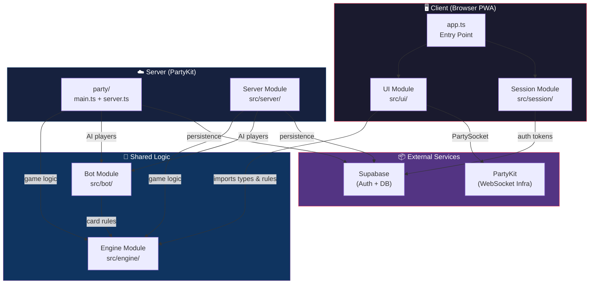
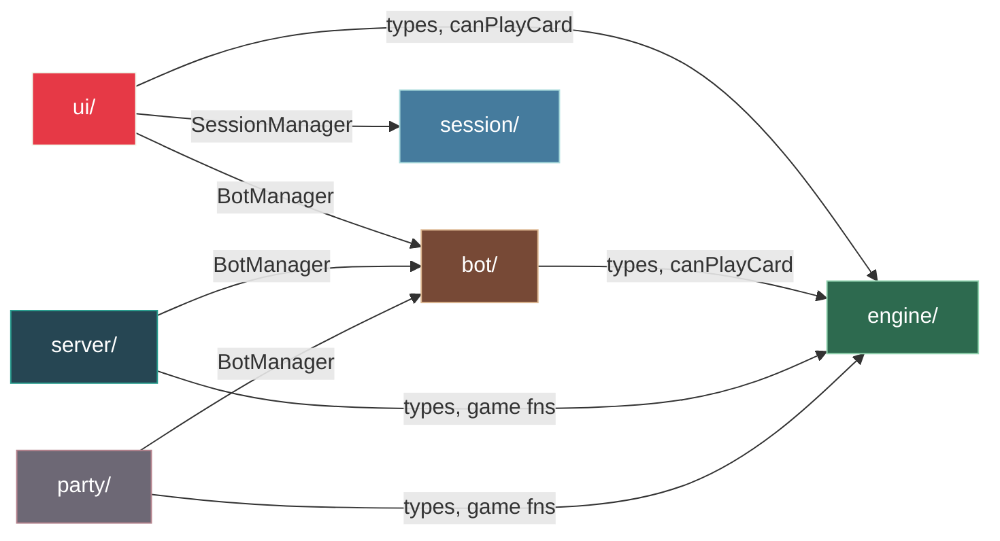
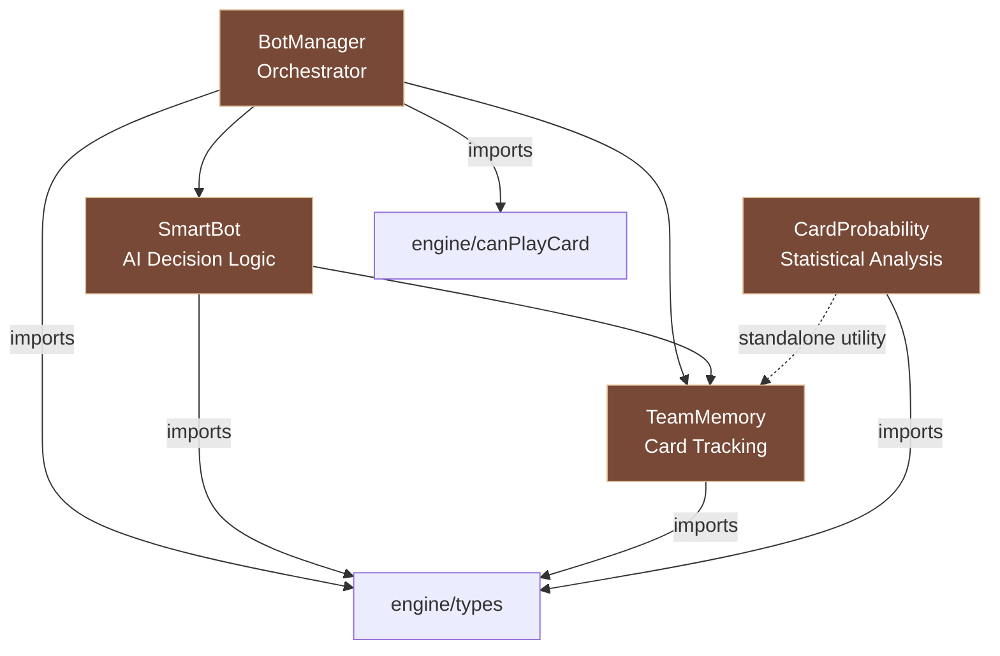
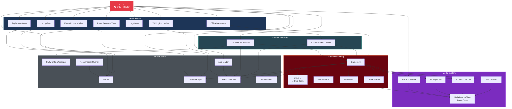
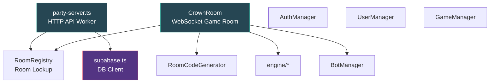
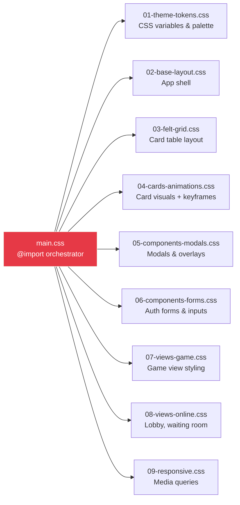
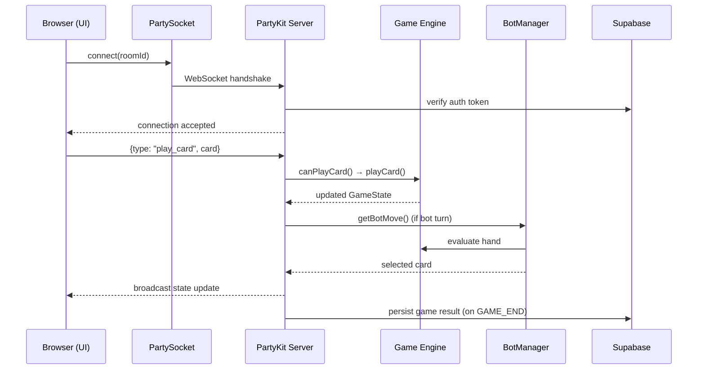

# Contract Crown — Architecture Graph

## High-Level System Architecture

---

## Module Dependency Graph

---

## Engine Module (`src/engine/`)

| File | Exports | Purpose |
|---|---|---|
| [types.ts](file:///Users/atifkhan/development/contract-krown/src/engine/types.ts) | `Card, Suit, Rank, Player, Trick, GameState, GamePhase` | Core domain types |
| [game-engine.ts](file:///Users/atifkhan/development/contract-krown/src/engine/game-engine.ts) | 22 pure functions (`createDeck`, `shuffle`, `playCard`, `canPlayCard`, `resolveTrick`, etc.) | Stateless game rules |

> [!NOTE]
> Engine has **zero** external dependencies — pure TypeScript logic only. All game state mutations happen through exported functions.

---

## Bot Module (`src/bot/`)

---

## UI Module (`src/ui/`) — Component Tree

---

## Server Module (`src/server/`)

---

## PartyKit Deployment Layer (`party/`)

| File | Role |
|---|---|
| [main.ts](file:///Users/atifkhan/development/contract-krown/party/main.ts) | HTTP API server (auth, rooms, leaderboard) — imports `engine`, `bot`, `supabase` |
| [server.ts](file:///Users/atifkhan/development/contract-krown/party/server.ts) | WebSocket game room server — imports `engine`, `bot`, `supabase` |

> [!IMPORTANT]
> `party/` files are **self-contained duplicates** of `src/server/` logic, deployed directly to PartyKit. They import from `../src/engine/` and `../src/bot/` but NOT from `src/server/`.

---

## CSS Architecture (`src/ui/styles/`)

> Built with **PostCSS** + **Tailwind CSS 3** + **DaisyUI 4**. Processed via `postcss-import` → single `styles.css` bundle.

---

## Test Structure (`tests/`)

| Directory | Coverage |
|---|---|
| `tests/property/` | fast-check property tests (TDD requirement) |
| `tests/engine/` | Game engine unit tests |
| `tests/bot/` | Bot AI logic tests |
| `tests/server/` | Server-side tests |
| `tests/session/` | Session manager tests |
| `tests/ui/` | UI component tests |
| `tests/client/` | Client integration tests |
| `tests/integration/` | Cross-module integration |
| `tests/e2e/` | Playwright end-to-end tests |

---

## External Dependencies

| Dependency | Layer | Purpose |
|---|---|---|
| `partykit` / `partysocket` | Server / Client | WebSocket multiplayer infrastructure |
| `@supabase/supabase-js` | Server + Session | Auth, user profiles, game persistence |
| `page` | Client | Client-side SPA routing |
| `ios-haptics` | Client | Touch feedback on iOS |
| `tailwindcss` + `daisyui` | Client CSS | Utility-first styling + component library |
| `fast-check` | Tests | Property-based testing |
| `playwright` | Tests | E2E browser testing |
| `vitest` / `bun test` | Tests | Unit test runner |

---

## Data Flow — Online Game

